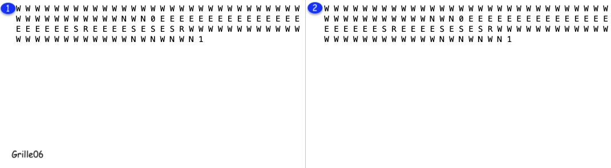
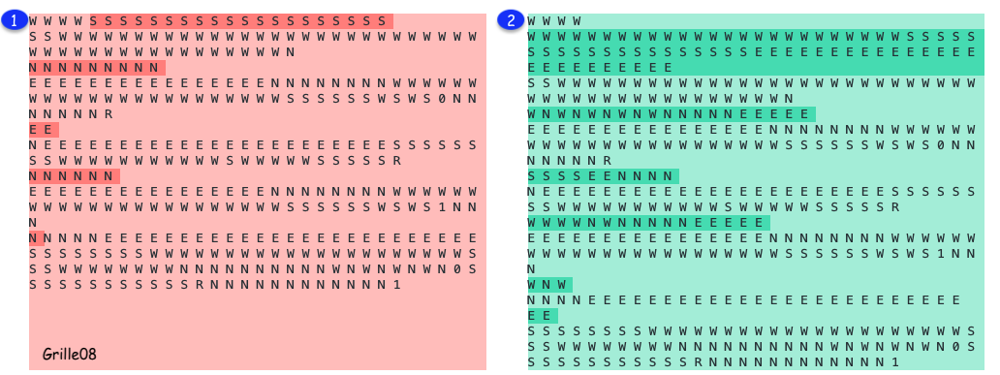

<h3>Travail pratique #1 : Recherche dans un espace d'états / Rétablir l'électricité</h3>
 

| Cours | Sigle | Université
| ------ | ------ | ------ |
|  Intelligence artificielle | INF4230 | UQÀM

## Auteur

| Prénom et nom de famille | Code permanent |
| ------ | ------ |
| Fadi Feghali | FEGF07069109 |

 

- **Heuristique #1 : distance euclidienne**

Définition : La distance Euclidienne est la plus courte distance entre deux points, appelée aussi distance à vol d'oiseau, 
c'est la racine carrée de la somme des carrés des différences de coordonnées en X et en Y.

La distance euclidienne est la distance minimale à parcourir entre deux points quelconques. 
le coût sera toujours inférieur ou égal au coût réel du dépalcement de l'équipe d'entretien qui ne se déplace que horizontalement ou verticalement, la rendant admissible.

Si la destination est à la verticale  ou à l'horizontal de la position actuelle de l'équipe d'entretien, la distance euclidienne sera la vraie distance. 
Sinon, si la destination est en diagonale de la position de l'équipe d'entretien, alors la distance euclidienne sera inférieure à la vraie distance. 
**Dans les deux cas**, la distance euclidienne est une borne inférieure de la vraie distance.

- **Heuristique #2 : carré de la distance euclidienne**

C'est plus rapide de manipuler des nombres entiers que la racine carré de l'heuristique #1.

Les résultats sont affichés dans le tableau suivant :

| Grille # | Heuristique #1 | Heuristique #2 |
| ------ | ------ | ------ |
| 06 | temps cpu : 0.310 | temps cpu : 0.011
| 08 | temps cpu : 4.256 | temps cpu : 2.855

 

 

**Nombre d'actions identique avec l'heuristique #1 et #2, mais l'heuristique #2 génère les résultats plus rapidement que l'heuristique #1.**
 

 

**Nombre d'actions plus grand avec l'heuristique #2, mais génère les résultats plus rapidement que l'heuristique #1, mais étant donné que le but du tp est 
de minimiser le nombre d'actions, l'heuristique #1 sera retenue.**
