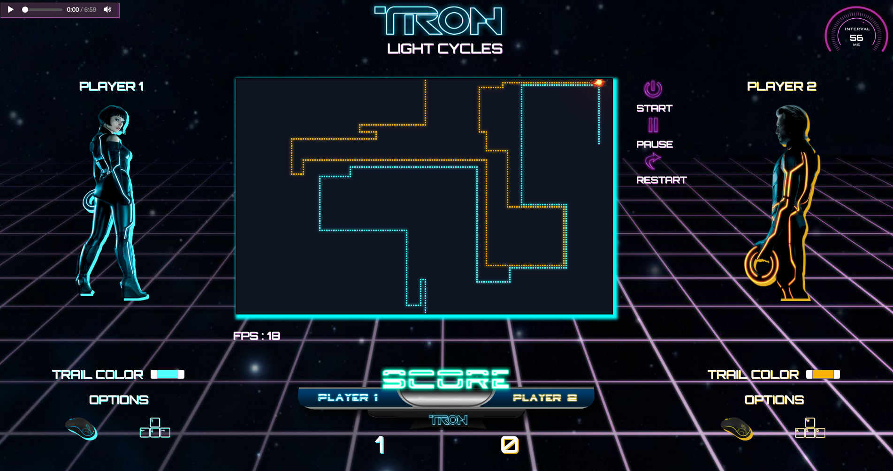

# Labo 1 - E2020
 

| Cours | Sigle | Université
| ------ | ------ | ------ |
|  Conception et évaluation des interfaces utilisateurs | GTI350 | ETS

## Auteur

| Prénom et nom de famille | Code permanent |
| ------ | ------ |
| Fadi Feghali | FEGF07069109 |

 

❗**L'application est diponible sur [heroku](http://gti350-tp1.herokuapp.com)**

**Sources utilisée :** 

- [Forum de discussion](https://stackoverflow.com)
- [images + icones](https://www.pngguru.com)

