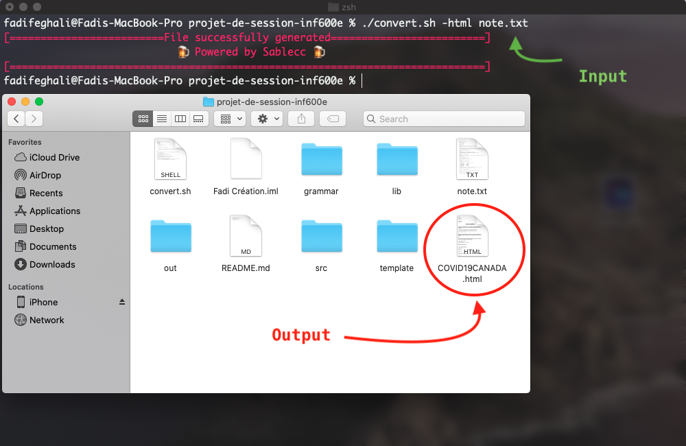
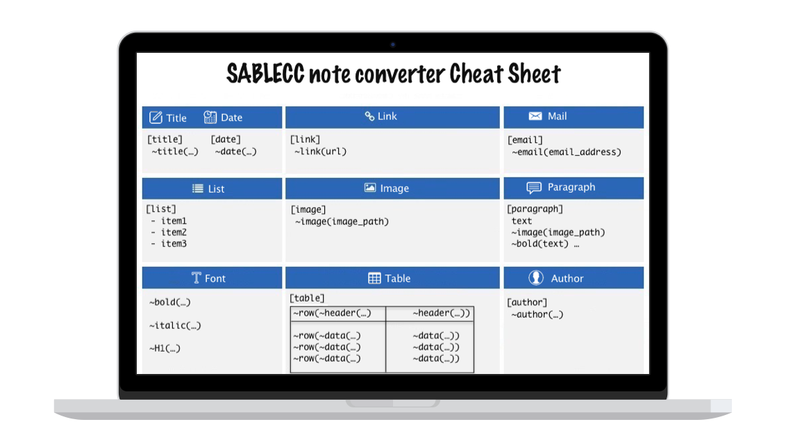

# Travail de session 

<br>

| Cours | Sigle | Université|
| ------ | ------ | ------ |
| CREATION DE LANGAGES INFORMATIQUES | INF600E | UQÀM |

<br>

| Prénom et nom de famille | Code permanent |
| ------ | ------ |
| Fadi Feghali | FEGF07069109 |
| Josue Torres | TORJ16029201 |

<br><br><br>

### Description du projet 

Dans ce travail final, nous avons developpé un langage de 'templating' (similaire à Markdown) qui est capable de convertir un fichier de note en <span style="color: red;">html, pdf, jpeg et png.</span>  

Une simple grammaire a été adoptée pour permettre à tout type d'utilisateur, incluant les non programmeurs, d'utiliser ce language.

L'idée du language nous est venue à l'esprit lors d'une séance de cours. Nous nous sommes aperçu que c'était difficile de taper des notes sans recourir à un programme de traitement de texte et sans devoir installer des programmes lourds.

De plus, nous voulions que le projet mène à un produit visuel et tangible afin que l'utilisateur puisse voir le plein potentiel de notre outil.

<br><br>

### Comment utiliser l'outils de conversion ?

```sh
$ ./convert [-FORMAT] note.txt
```	

⚠️ -FORMAT : html, pdf, jpeg, png

-- **Le fichier converti sera placé à la racine du projet** --

<br><br>

<div style="text-align:center">

### Exemple : 

<br>



<br><br>

### Apperçu :

<br>


</div>

<br> 

<br><br>

<div style="text-align:center">

### Le fichier source doit respecter la syntaxe suivante :



</div>

<br><br>

### Structure du code source

- La grammaire du langage se trouve dans le répertoire `grammar/interpreter.sablecc`.

- La majorité du code se trouve dans la classe `Program.java`.

- Un gabarit `html` se trouve dans le répertoire `template/template.html`, responsable de générer le code html de départ.


</div>

<br><br>

### État du projet

Quelques bogues ont été rencontrés lors de la conception de ce travail, à noter : 

- L'encodage UTF-8 n'est pas supporté pour cette remise. 

- L'appel vers L'API responsable de la conversion du fichier source vers le format pdf ne supporte pas les liens
 vers des images locales sur l'ordinateur de l'utilisateur. 
 Pour ce faire, une solution temporaire a été mise en oeuvre; qui consiste à utiliser des sources d'images distantes. 

<br><br>